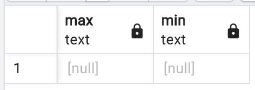
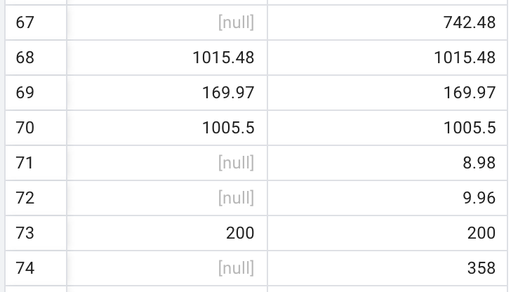
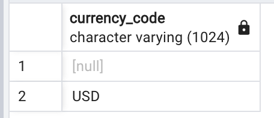
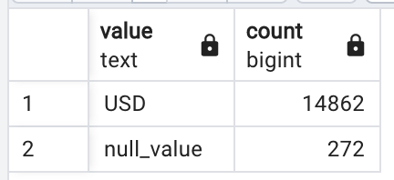

What are your risk areas? Identify and describe them.

1. Before dropping any column, I need to make sure there is no value in it. I use the ```max()``` and ```min()``` before deleting them. They should both return ***null*** to ensure there is no value. If either of them is not ***null***, a further step is needed to look up how many values are there and does those values make any sense in answering the questions.

2. The column transaction_revenue has 4 values, which need to be double check before dropping.

3. There when counting on the product_category or grouping by product_catory, I find some of the product_category value is not having a complete path that follows the format "Home/%". Therefore, I need to SELECT the values using LIKE and fix the short path with a corresponding full path. For example:

| Short Category | Full Category | But Avoiding |
| ----------- | ----------- | ----------- | 
| Headgear | Home/Apparel/Headgear/ |  |
| Bags | Home/Bags/ | Home/Limited Supply/Bags/  |
| Apparel | Home/Apparel/ | Home/Apparel/Men's/ |

4. Before deleting duplicated rows, I want to investigate how many duplicated rows each individual row has.

5. Make sure the currency is the same before calculating revenue-related items.

---

QA Process:
Describe your QA process and include the SQL queries used to execute it.
1. Verify the empty columns:

SQL Queries:
```SQL
SELECT 
	MAX(product_refund_amount), 
	MIN(product_refund_amount)
FROM public.all_sessions
;
```
Result:
<div style="text-align:center">

</div>

---

2. When deleting the the column ***transaction_renenue*** in table **all_sessions**, I did a check of the existing 4 values. I compare those values to that in the column ***total_transaction_renenue***. I found that they are the same value. Therefore, column ***transaction_renenue*** can be deleted with confidence.

SQL Queries:
```SQL
SELECT transaction_revenue, total_transaction_revenue
FROM public.all_sessions
WHERE transaction_revenue is not null or total_transaction_revenue is not null;
```

Result:
<div style="text-align:center">

</div>

---

3. Fixing the product_category values:

SQL Queries:
```SQL
-- replace v2_product_category value to a full value
-- keyword 1: Headgear
SELECT DISTINCT v2_product_category
FROM public.all_sessions
WHERE v2_product_category not in ('(not set)') AND
	v2_product_category LIKE '%Headgear%'
;
/*
"Headgear"
"Home/Apparel/Headgear/"
*/
UPDATE public.all_sessions
SET v2_product_category = 'Home/Apparel/Headgear/'
WHERE v2_product_category ='Headgear'
;
/*
"Home/Apparel/Headgear/"
*/

-- keyword 2: Bottles
SELECT DISTINCT v2_product_category
FROM public.all_sessions
WHERE v2_product_category LIKE '%Bottles%' AND
		v2_product_category not in ('(not set)')
;
-- result
/*
"Bottles/"
"Home/Drinkware/Water Bottles and Tumblers/"
*/

UPDATE public.all_sessions
SET v2_product_category = 'Home/Drinkware/Water Bottles and Tumblers/'
WHERE v2_product_category = 'Bottles/'
;
/*
"Home/Drinkware/Water Bottles and Tumblers/"
*/
```

---

4. When deleting the duplicate rows in the column analytics, I use `SELECT DISTINCT * ` to filter the duplicated ones. This clause means the rows must have the same value on all columns to be detected as a duplicate. I make a query by assigning the `ROW_NUMBER()` window function to locate the duplicated row(s) of each ***DISTINCT*** row.

SQL Queries:
```SQL
SELECT *
		FROM (
				SELECT 
						visit_number,
						visit_id,
						visit_date,
						fullvisitor_id,
						channel_grouping,
						social_engagement_type,
						units_sold,
						pageviews,
						time_on_site,
						bounces,
						revenue,
						unit_price,
						visit_start_time,
					    ROW_NUMBER() OVER (
                            PARTITION BY
                            visit_number,
                            visit_id,
                            visit_date,
                            fullvisitor_id,
                            channel_grouping,
                            social_engagement_type,
                            units_sold,
                            pageviews,
                            time_on_site,
                            bounces,
                            revenue,
                            unit_price,
                            visit_start_time
                        ) -1 AS duplicate
				FROM public.analytics
				ORDER BY											    
						visit_number,
						visit_id,
						visit_date,
						fullvisitor_id,
						channel_grouping,
						social_engagement_type,
						units_sold,
						pageviews,
						time_on_site,
						bounces,
						revenue,
						unit_price,
						visit_start_time,
						duplicate DESC
			) as duplicateFound
WHERE duplicate > 0 
```

Result:
It returns $2561814$ rows. This number equals the difference between the number of original rows and the number of ***DISTINCT*** rows.

---
5. When doing the monetary related calculation, I need to make sure all the amounts are in the same currency. I query the DISTINCT values in column ***currency_code*** and find out there are only two distinct values: 'USD' and null. Then I query the number of nulls to be a small portion of the total values. Therefore, there is a great chance all the transactions are in USD, and there is no need to convert the currencies. 

SQL Queries:
```SQL
SELECT DISTINCT currency_code
FROM public.all_sessions
;

-- potential risk
SELECT 'USD' "value", COUNT(*)
FROM public.all_sessions
WHERE currency_code = 'USD'
UNION
SELECT 'null_value', COUNT(*)
FROM public.all_sessions
WHERE currency_code is null
;
```

Result:

<div style="text-align:center">

</div>

<div style="text-align:center">

</div>