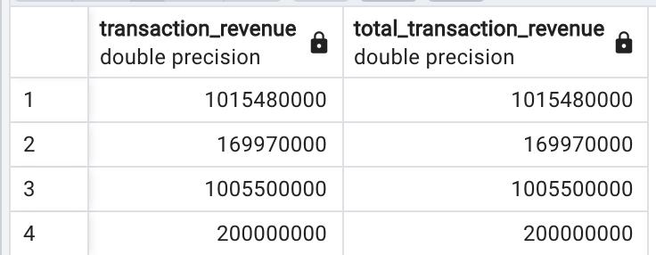
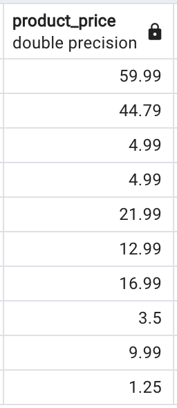
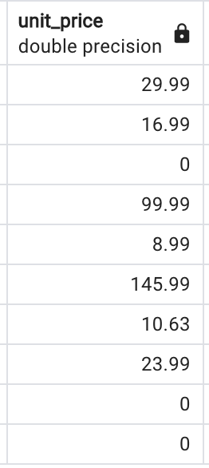

What issues will you address by cleaning the data?
### All Tables:
1. When creating the tables, I find that some of the column names from the CSV files are preserved keywords in SQL. To avoid any potential trouble that might be caused by those column names, I renamed them accordingly:
This is the code of my first attempt to create tables. I found the highlighted keywords there:
```SQL
-- create tables
CREATE TABLE all_sessions (
		full_visitor_id	VARCHAR (1024),
		channel_grouping	VARCHAR (1024),
		time	BIGINT,
		country	VARCHAR (1024),
		city	VARCHAR (1024),
		total_transaction_revenue	DOUBLE PRECISION,
		transactions	BIGINT,
		time_on_site	BIGINT,
		pageviews	BIGINT,
		session_quality_dim	BIGINT,
		date	DATE,
		visit_id	BIGINT,
		type	VARCHAR (1024),
		product_refund_amount	VARCHAR (1024),
		product_quantity	BIGINT,
		product_price	DOUBLE PRECISION,
		product_revenue	DOUBLE PRECISION,
		product_sku	VARCHAR (1024),
		v2_product_name	VARCHAR (1024),
		v2_product_category	VARCHAR (1024),
		product_variant	VARCHAR (1024),
		currency_code	VARCHAR (1024),
		item_quantity	BIGINT,
		item_revenue	DOUBLE PRECISION,
		transaction_revenue	DOUBLE PRECISION,
		transaction_id	VARCHAR (1024),
		page_title	VARCHAR (1024),
		search_keyword	VARCHAR (1024),
		page_path_level1	VARCHAR (1024),
		e_commerce_action_type	BIGINT,
		e_commerce_action_step	BIGINT,
		e_commerce_action_option	VARCHAR (1024)
);

CREATE TABLE analytics (
		visit_number	BIGINT,
		visit_id	BIGINT,
		visit_start_time	BIGINT,
		date	BIGINT,
		fullvisitor_id	VARCHAR (1024),
		userid	VARCHAR (1024),
		channel_grouping	VARCHAR (1024),
		social_engagement_type	VARCHAR (1024),
		units_sold	BIGINT,
		pageviews	BIGINT,
		timeonsite	BIGINT,
		bounces	BIGINT,
		revenue	DOUBLE PRECISION,
		unit_price	DOUBLE PRECISION
);

CREATE TABLE products (
		sku	VARCHAR (1024),
		name	VARCHAR (1024),
		ordered_quantity	BIGINT,
		stock_level	BIGINT,
		restocking_lead_time	BIGINT,
		sentiment_score	DOUBLE PRECISION,
		sentiment_magnitude	DOUBLE PRECISION
);

CREATE TABLE sales_by_sku (
		product_sku	VARCHAR (1024),
		total_ordered	BIGINT
);

CREATE TABLE sales_report (
		product_sku	VARCHAR (1024),
		total_ordered	BIGINT,
		name	VARCHAR (1024),
		stock_level	BIGINT,
		restocking_lead_time	BIGINT,
		sentiment_score	DOUBLE PRECISION,
		sentiment_magnitude	DOUBLE PRECISION,
		ratio	DOUBLE PRECISION
)

```
- To resolve the conflicts with preserved keywords, some keys are renamed as follows:

| Table Name | Column before renaming | Column after renaming |
| ----------- | ----------- | ----------- | 
| all_sessions | time | session_time |
|  | date | session_date |
|  | type | visit_type |
| analytics | date | visit_date | 
| products | name | product_name | 
| sales_report | name | product_name | 

- to make the keys consistent among tables, the following renaming is carried out:

| Table Name | Column before renaming | Column after renaming |
| ----------- | ----------- | ----------- | 
| all_sessions | time_on_site | (*unchnaged*)) |
| analytics | timeonsite | time_on_site | 
| analytics | fullvisitor_id | full_visitor_id | 
| products | sku | product_sku | 

- To leave the column name *visit_start_time* for the converted time column, the imported one is renamed as:

| Table Name | Column before renaming | Column after renaming |
| ----------- | ----------- | ----------- | 
| analytics | visit_start_time | visit_start_timestamp |

After renaming, the code looks like the following. From the syntax highlighting, it can be confirmed that there are no more conflicts with the preserved keywords.

Another consideration that needs to be mentioned here is the choice of the datatype for full_visitor_id:
|  | Value | In scientific notation |
| ----------- | ----------- | ----------- | 
| max allowed as BIGINT  | 9223372036854775807 | 9.2234E+18 |
| max in full_visitor_id | 9999679083512798585 | 9.9997E+18 |

Therefore, ***full_visitor_id*** needs to be in the VARCHAR type.


```SQL
-- create tables
CREATE TABLE all_sessions (
		full_visitor_id	VARCHAR (500),
		channel_grouping	VARCHAR (1024),
		session_time	BIGINT,
		country	VARCHAR (1024),
		city	VARCHAR (1024),
		total_transaction_revenue	DOUBLE PRECISION,
		transactions	BIGINT,
		time_on_site	BIGINT,
		pageviews	BIGINT,
		session_quality_dim	BIGINT,
		session_date	DATE,
		visit_id	BIGINT,
		visit_type	VARCHAR (1024),
		product_refund_amount	VARCHAR (1024),
		product_quantity	BIGINT,
		product_price	DOUBLE PRECISION,
		product_revenue	DOUBLE PRECISION,
		product_sku	VARCHAR (1024),
		v2_product_name	VARCHAR (1024),
		v2_product_category	VARCHAR (1024),
		product_variant	VARCHAR (1024),
		currency_code	VARCHAR (1024),
		item_quantity	BIGINT,
		item_revenue	DOUBLE PRECISION,
		transaction_revenue	DOUBLE PRECISION,
		transaction_id	VARCHAR (1024),
		page_title	VARCHAR (1024),
		search_keyword	VARCHAR (1024),
		page_path_level1	VARCHAR (1024),
		e_commerce_action_type	BIGINT,
		e_commerce_action_step	BIGINT,
		e_commerce_action_option	VARCHAR (1024)
);

CREATE TABLE analytics (
		visit_number BIGINT,
		visit_id BIGINT,
		visit_start_timestamp BIGINT,  
		visit_date DATE,
		fullvisitor_id	VARCHAR (1024),
		userid	VARCHAR (1024),
		channel_grouping	VARCHAR (1024),
		social_engagement_type	VARCHAR (1024),
		units_sold	BIGINT,
		pageviews	BIGINT,
		time_on_site	BIGINT,
		bounces	BIGINT,
		revenue	DOUBLE PRECISION,
		unit_price	DOUBLE PRECISION
);

CREATE TABLE products (
		product_sku	VARCHAR (1024),
		product_name	VARCHAR (1024),
		ordered_quantity	BIGINT,
		stock_level	BIGINT,
		restocking_lead_time	BIGINT,
		sentiment_score	DOUBLE PRECISION,
		sentiment_magnitude	DOUBLE PRECISION
);

CREATE TABLE sales_by_sku (
		product_sku	VARCHAR (1024),
		total_ordered	BIGINT
);

CREATE TABLE sales_report (
		product_sku	VARCHAR (1024),
		total_ordered	BIGINT,
		product_name	VARCHAR (1024),
		stock_level	BIGINT,
		restocking_lead_time	BIGINT,
		sentiment_score	DOUBLE PRECISION,
		sentiment_magnitude	DOUBLE PRECISION,
		ratio	DOUBLE PRECISION
);
```
---

2. For importing the CSV files by command line, one thing that should be marked down here for future reference is: creating a folder under the path of */private/tmp/week1project_data*. It can avoid potential permission errors like:
```
ERROR:  could not open file "/Users/ds/Documents/week_1_project/all_sessions.csv" for reading: Permission denied
HINT:  COPY FROM instructs the PostgreSQL server process to read a file. You may want a client-side facility such as psql's \copy.
SQL state: 42501
```

* If necessary the tables can be duplicated as a reference.

```SQL
CREATE TABLE _bak_all_sessions AS 
SELECT *
FROM all_sessions;

CREATE TABLE _bak_analytics AS 
SELECT *
FROM analytics;

CREATE TABLE _bak_products AS 
SELECT *
FROM products;

CREATE TABLE _bak_sales_by_sku AS 
SELECT *
FROM sales_by_sku;

CREATE TABLE _bak_sales_report AS 
SELECT *
FROM sales_report;
```
---

3. Delete the empty columns on the original tables. For example, those blank columns in the all_sessions are deleted:
```SQL
-- Step 2: data cleaning

-- drop columns in: public.all_sessions                                             -- min() | max() | count(nonNullValue)
-- ALTER TABLE public.all_sessions DROP COLUMN total_transaction_revenue;			-- 1015480000	7500000	81	-- this one probably could be delete.
-- ALTER TABLE public.all_sessions DROP COLUMN transactions;						-- 1	1	81
ALTER TABLE public.all_sessions DROP COLUMN product_refund_amount;					-- 		0
-- ALTER TABLE public.all_sessions DROP COLUMN product_quantity;					-- 65	1	53
-- ALTER TABLE public.all_sessions DROP COLUMN product_revenue;						-- 176400000	58656666	4
ALTER TABLE public.all_sessions DROP COLUMN item_quantity;							-- 		0
ALTER TABLE public.all_sessions DROP COLUMN item_revenue;							-- 		0
ALTER TABLE public.all_sessions DROP COLUMN transaction_revenue;					-- 1015480000	169970000	4
-- ALTER TABLE public.all_sessions DROP COLUMN transaction_id;						-- "ORD201707132060"	"ORD201611011533"	9
ALTER TABLE public.all_sessions DROP COLUMN search_keyword;							-- 		0
-- ALTER TABLE public.all_sessions DROP COLUMN e_commerce_action_option;			-- "Review"	"Billing and Shipping"	31

-- drop columns in: public.analytics
ALTER TABLE public.analytics DROP COLUMN userid;									-- 		0
-- ALTER TABLE public.analytics DROP COLUMN units_sold;								-- 4324	-89	95147
-- ALTER TABLE public.analytics DROP COLUMN timeonsite;								-- 11316	1	3823657
-- ALTER TABLE public.analytics DROP COLUMN revenue;									-- 6252750000	1123333	15355
```

what should be noticed is that: although the ***transaction_revenue*** has 4 valid values, these 4 values are duplicates ***total_transaction_revenue***.

The query used:
```SQL
-- examing the duplicates on column transaction_revenue
SELECT transaction_revenue, total_transaction_revenue
FROM public.all_sessions
WHERE transaction_revenue is not null;
```

Result:

<div style="text-align:center"></div>

---

4. Check the distinct rows in each table.
```SQL
-- table 1:
SELECT 'all_sessions' as "Table Name", 'originalRows' as "Category", COUNT(*)
FROM public.all_sessions
UNION
SELECT 'all_sessions', 'distinctRows', COUNT (*)
FROM (
	SELECT DISTINCT *
	FROM public.all_sessions
) as distinctList 

-- table 2:
UNION

SELECT 'analytics' as "Table Name", 'originalRows' as "Category", COUNT(*)
FROM public.analytics
UNION
SELECT 'analytics', 'distinctRows', COUNT (*)
FROM (
	SELECT DISTINCT *
	FROM public.analytics
) as distinctList 

-- table 3:
UNION 

SELECT 'products' as "Table Name", 'originalRows' as "Category", COUNT(*)
FROM public.products
UNION
SELECT 'products', 'distinctRows', COUNT (*)
FROM (
	SELECT DISTINCT *
	FROM public.products
) as distinctList 

-- table 4:
UNION 

SELECT 'sales_by_sku' as "Table Name", 'originalRows' as "Category", COUNT(*)
FROM public.sales_by_sku
UNION
SELECT 'sales_by_sku', 'distinctRows', COUNT (*)
FROM (
	SELECT DISTINCT *
	FROM public.sales_by_sku
) as distinctList 

-- table 5:
UNION 

SELECT 'sales_report' as "Table Name", 'originalRows' as "Category", COUNT(*)
FROM public.sales_report
UNION
SELECT 'sales_report', 'distinctRows', COUNT (*)
FROM (
	SELECT DISTINCT *
	FROM public.sales_report
) as distinctList 

ORDER BY "Table Name", "Category"
```

<div style="text-align:center"></div>


There are many duplicates in the table *analytics*. 
$$ N_{Duplicates} = 4301122 - 1739308 = 2561814 $$

---

5. Investigating the details of the duplicates in ***analytics***

```SQL
SELECT *
		FROM (
				SELECT 
						visit_number,
						visit_id,
						visit_date,
						fullvisitor_id,
						channel_grouping,
						social_engagement_type,
						units_sold,
						pageviews,
						time_on_site,
						bounces,
						revenue,
						unit_price,
						visit_start_time,
					    ROW_NUMBER() OVER (
                            PARTITION BY
                            visit_number,
                            visit_id,
                            visit_date,
                            fullvisitor_id,
                            channel_grouping,
                            social_engagement_type,
                            units_sold,
                            pageviews,
                            time_on_site,
                            bounces,
                            revenue,
                            unit_price,
                            visit_start_time
                        ) -1 AS duplicate
				FROM public.analytics
				ORDER BY											    
						visit_number,
						visit_id,
						visit_date,
						fullvisitor_id,
						channel_grouping,
						social_engagement_type,
						units_sold,
						pageviews,
						time_on_site,
						bounces,
						revenue,
						unit_price,
						visit_start_time,
						duplicate DESC
			) as duplicateFound
WHERE duplicate > 0 
```
It returns $2561814$ rows, which are exactly those duplicated rows. This is part of Quality Assurance.

---

6. Correct the product price, by dividing it with 1,000,000

| Table Name | Column Name | Issue(s) |
| ----------- | ----------- | ----------- | 
| all_sessions | product_price | divided by 1,000,000 |
|  | transaction_revenue | divided by 1,000,000 |
|  | total_transaction_revenue | divided by 1,000,000 |
| analytics | unit_price | divided by 1,000,000 |

transaction_revenue

The query used:
```SQL
-- correct the product_price, unit_price, divided by 1,000,000
UPDATE
public.all_sessions
SET product_price = product_price / 1e6;

UPDATE
public.analytics
SET unit_price = unit_price / 1e6;
```


<div style="text-align:center">


</div>

---

7. Other known issues:

| Table | Column | Issue(s) |
| ----------- | ----------- | ----------- | 
| all_sessions | city | some values are 'not available in demo dataset' |
| all_sessions | transaction_revenue | only 4 valid value  |
| all_sessions | v2_product_category | incomplete path |

Incomplete category value in table ***all_sessions***, and they need to be transformed to the corresponding full category name:
| Incomplete / Wrong | Complete | 
| ----------- | ----------- | 
| Headgear | Home/Apparel/Headgear/ |
| Bottles/ | Home/Drinkware/Water Bottles and Tumblers/ |
| Lifestyle | Home/Lifestyle/ |
| Lifestyle/ | Home/Lifestyle/ |
| Housewares | Home/Accessories/Housewares/ |
| Drinkware | Home/Drinkware/ |
| Home/Accessories/Drinkware/ | Home/Drinkware/ |
| Apparel | Home/Apparel/ |
| Bags | Home/Bags/ |
| Electronics | Home/Electronics/ |
| Office | Home/Office/ |
| Waze | Home/Shop by Brand/Waze/ |
| YouTube | Home/Shop by Brand/YouTube/ |
| Wearables/Men's T-Shirts/ | Home/Apparel/Men's/Men's-T-Shirts/ |
| Nest-USA | Home/Nest/Nest-USA/ |
| YouTube | Home/Shop by Brand/YouTube/ |
| Home/Brands/Android/ | Home/Shop by Brand/Android/ |
| 'Home/Brands/YouTube/ | Home/Shop by Brand/YouTube/ |