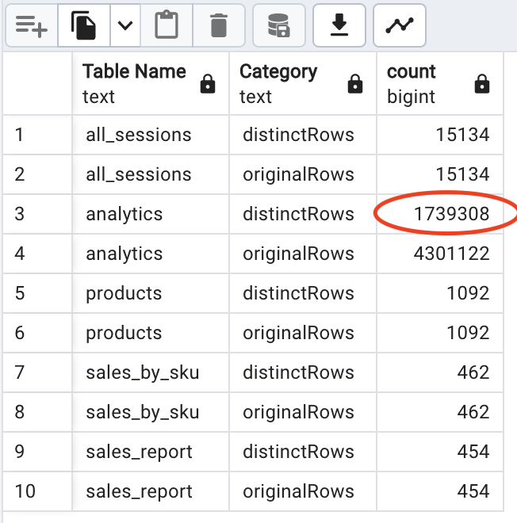
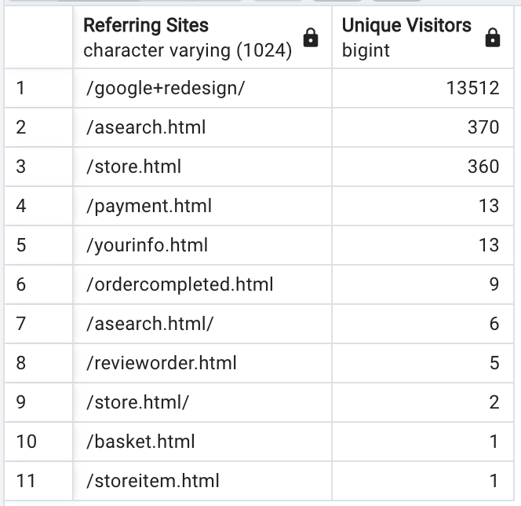
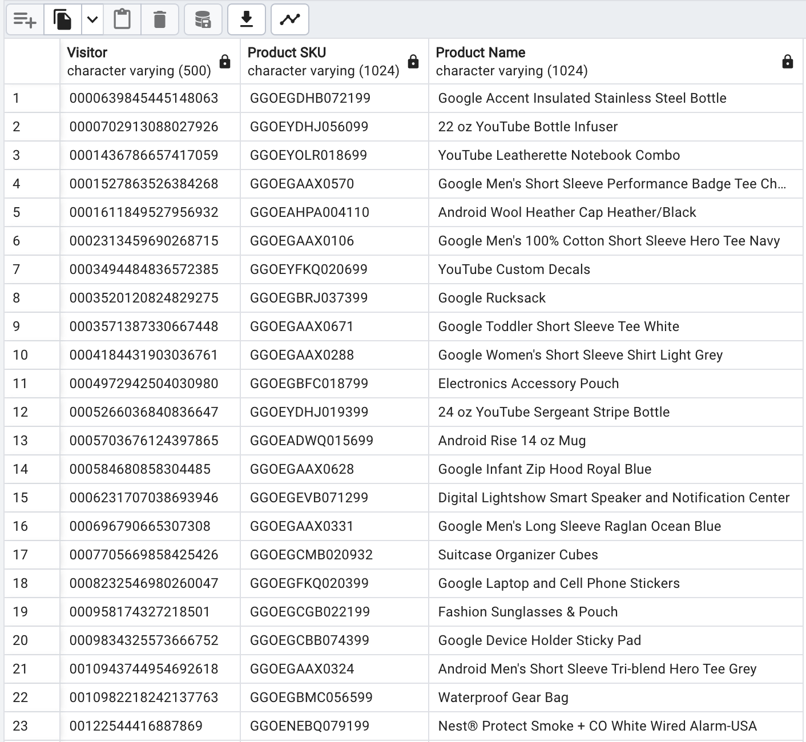

Question 1: find all duplicate records

SQL Queries:


* Finding the duplicates:

```SQL
-- table 1: all_sessions
SELECT 'all_sessions' as "Table Name", 'originalRows' as "Category", COUNT(*)
FROM public.all_sessions
UNION
SELECT 'all_sessions', 'distinctRows', COUNT (*)
FROM (
	SELECT DISTINCT *
	FROM public.all_sessions
) as distinctList 

-- table 2: analytics
UNION

SELECT 'analytics' as "Table Name", 'originalRows' as "Category", COUNT(*)
FROM public.analytics
UNION
SELECT 'analytics', 'distinctRows', COUNT (*)
FROM (
	SELECT DISTINCT *
	FROM public.analytics
) as distinctList 

-- table 3: products
UNION 

SELECT 'products' as "Table Name", 'originalRows' as "Category", COUNT(*)
FROM public.products
UNION
SELECT 'products', 'distinctRows', COUNT (*)
FROM (
	SELECT DISTINCT *
	FROM public.products
) as distinctList 

-- table 4: sales_by_sku
UNION 

SELECT 'sales_by_sku' as "Table Name", 'originalRows' as "Category", COUNT(*)
FROM public.sales_by_sku
UNION
SELECT 'sales_by_sku', 'distinctRows', COUNT (*)
FROM (
	SELECT DISTINCT *
	FROM public.sales_by_sku
) as distinctList 

-- table 5: sales_report
UNION 

SELECT 'sales_report' as "Table Name", 'originalRows' as "Category", COUNT(*)
FROM public.sales_report
UNION
SELECT 'sales_report', 'distinctRows', COUNT (*)
FROM (
	SELECT DISTINCT *
	FROM public.sales_report
) as distinctList 

ORDER BY "Table Name", "Category"
;

```
* Deleting the duplicates by creating a new table and delete the old one:

```SQL
-- remove duplicates from table "analytics"
ALTER TABLE analytics
RENAME TO analytics_temp;

CREATE TABLE analytics AS
SELECT DISTINCT *
FROM analytics_temp;

DROP TABLE public.analytics_temp;
```

Answer:

<div style="text-align:center">

</div>

By comparing the number of ***DISTINCT*** rows to that of the original rows, it can be concluded: table analytics has $$ N_{Duplicates} = 4301122 - 1739308 = 2561814 $$ rows of duplicates.

A new table is created, all the ***DISTINCT*** values are copied into the new table, and the old table is dropped.


---
Question 2: find the total number of unique visitors (`fullVisitorID`)

SQL Queries:

```SQL
SELECT COUNT(*)
FROM (
		SELECT DISTINCT full_visitor_id 
		FROM public.all_sessions
		WHERE full_visitor_id is not null
	) AS distinct_visitor
```

Answer: $14223$

---
Question 3: find the total number of unique visitors by referring sites

SQL Queries:

```SQL
SELECT 
	page_path_level1 as "Referring Sites",
	COUNT(full_visitor_id) as "Unique Visitors"
FROM (
	SELECT DISTINCT *
	FROM (
		SELECT 
			page_path_level1, 
			full_visitor_id
		FROM public.all_sessions
		WHERE 
			full_visitor_id is not null AND
			page_path_level1 is not null
	) ref_visitor
) as distinct_list
GROUP BY page_path_level1
ORDER BY "Unique Visitors" DESC
;
```

Answer:

<div style="text-align:center">

</div>

---

Question 4: find each unique product viewed by each visitor

SQL Queries:

```SQL
SELECT 
	full_visitor_id as "Visitor",
	product_sku as "Product SKU",
	v2_product_name as "Product Name"
FROM (
	SELECT DISTINCT *
	FROM (
		SELECT 
			full_visitor_id, 
			product_sku,
			v2_product_name
		FROM public.all_sessions
		WHERE 
			full_visitor_id is not null AND
			product_sku is not null AND
			v2_product_name is not null
	) visitor_product
) as distinct_list
ORDER BY full_visitor_id
;
```

Answer:

<div style="text-align:center">

</div>

---
Question 5: compute the percentage of visitors to the site that actually makes a purchase

SQL Queries:

```SQL
with purchased_number as(

	SELECT '1' as "ID", COUNT(*) as purchased
	FROM public.all_sessions
		WHERE 
				full_visitor_id is not null AND
				total_transaction_revenue is not null
)
, 
all_visitor_number as(

	SELECT '1' as "ID", COUNT(*) as allvisitor
	FROM public.all_sessions
		WHERE 
				full_visitor_id is not null 
)	

SELECT allvisitor "All Visitors", purchased "Purchased Visitors", cast(purchased as real) / cast(allvisitor as real) * 100 as "Percentage"
FROM all_visitor_number
OUT JOIN purchased_number USING ("ID")
;
```

Answer: 0.535%

<div style="text-align:center">

</div>
