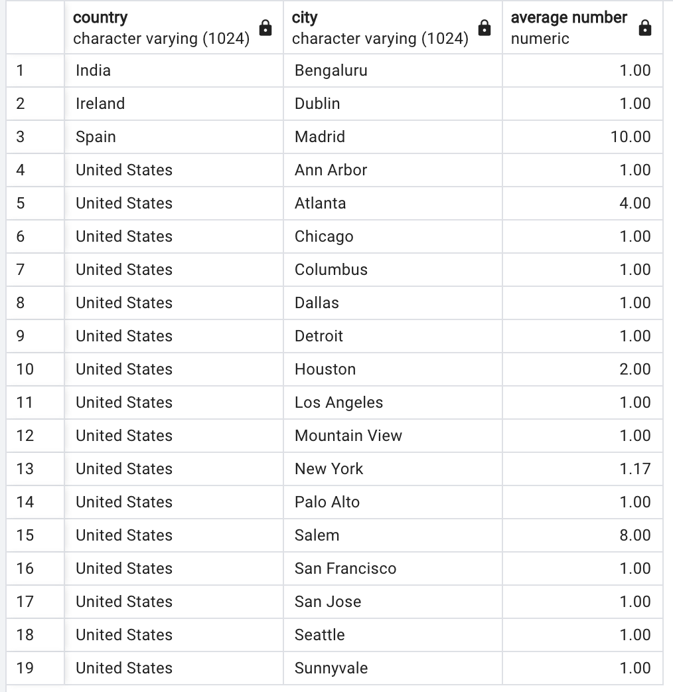

Answer the following questions and provide the SQL queries used to find the answer.

    
**Question 1: Which cities and countries have the highest level of transaction revenues on the site?**


SQL Queries:
```SQL
-- Check the total revenue from each country and city, from the column "total_transaction_revenue"
SELECT country, city, subTotal as "Total" , '"total_transaction_revenue"'as "Source Column"
FROM (
	SELECT *, RANK () OVER(
						   ORDER BY subTotal DESC) rank_number
	FROM(
			SELECT country, city,  ROUND(SUM(total_transaction_revenue)) as subTotal
			FROM (SELECT country, city, total_transaction_revenue
				  FROM public.all_sessions
				  WHERE (total_transaction_revenue is not null) AND 
				  		(country is not null) AND 
				  		(city is not null) and city != 'not available in demo dataset'
				  ) AS notNullLIST
			GROUP BY country, city
			ORDER BY country, city
		) as sumList
	ORDER BY rank_number
	) as ranked
WHERE rank_number = 1
;
```


Answer:

San Francisco

<div style="text-align:center"></div>

---
**Question 2: What is the average number of products ordered from visitors in each city and country?**


SQL Queries:

```SQL
-- find the average number of products ordered by country and city 
SELECT country, city, round(avg(product_quantity), 2) as "average number"
	FROM (SELECT country, city, product_quantity
		FROM public.all_sessions
		WHERE (product_quantity is not null) AND 
				(country is not null) AND
				(country not in ('not available in demo dataset', '(not set)')) AND
				(city is not null) AND
				(city not in ('not available in demo dataset', '(not set)'))
		) AS notNullLIST
	GROUP BY country, city
ORDER BY country, city
;
```

Answer:

As listed in the form:
<div style="text-align:center"></div>


---
**Question 3: Is there any pattern in the types (product categories) of products ordered from visitors in each city and country?**


SQL Queries:
```SQL
-- find the most and least popular category
(
SELECT 'Top 10' as "Chart", v2_product_category as "Category Name", SUM(count_category) as "mode"
FROM(
		SELECT country, city, v2_product_category,count(v2_product_category) count_category
		FROM (
			SELECT *
			FROM public.all_sessions
			WHERE (country is not null) AND
				NOT (country in ('not available in demo dataset', '(not set)' )) AND
				(city is not null) AND
				NOT (city in ('not available in demo dataset', '(not set)' )) AND
				(v2_product_category is not null) AND
				NOT(v2_product_category in ('(not set)')) AND
				v2_product_category LIKE 'Home/%'
			) as notNullList
		GROUP BY country, city, v2_product_category
		ORDER BY country, city, count_category DESC
	) as statsTable
GROUP BY v2_product_category
ORDER BY "mode" DESC
LIMIT 10
)
UNION
(
SELECT 'Bottom 10' as "Chart", v2_product_category as "Category Name", SUM(count_category) as "mode"
FROM(
		SELECT country, city, v2_product_category,count(v2_product_category) count_category
		FROM (
			SELECT *
			FROM public.all_sessions
			WHERE (country is not null) AND
				NOT (country in ('not available in demo dataset', '(not set)' )) AND
				(city is not null) AND
				NOT (city in ('not available in demo dataset', '(not set)' )) AND
				(v2_product_category is not null) AND
				NOT(v2_product_category in ('(not set)')) AND
				v2_product_category LIKE 'Home/%'
			) as notNullList
		GROUP BY country, city, v2_product_category
		ORDER BY country, city, count_category DESC
	) as statsTable
GROUP BY v2_product_category
ORDER BY "mode" ASC
LIMIT 10
)
ORDER BY "Chart" DESC, "mode" DESC
;
```


Answer:

As listed in the form:
<div style="text-align:center"></div>


---
**Question 4: What is the top-selling product from each city/country? Can we find any pattern worthy of noting in the products sold?**


SQL Queries:
```SQL
-- THe popularity_score gives the how much a product rank on top, the higher the popular.
-- The cume_dist() window function is used to evaluate the popularity within each "country/city" PARTITION.
-- Then, sum() by products gives the overall popularity.
SELECT "Product Name", round (SUM(pop_SCORE) ) as popularity_score
FROM (
		SELECT 
				country as "Country", 
				city as "City" , 
				"Product Name", 
				"mode" as "Product Quantity", 
				v2_product_category as "Category", 
				SUM("mode") OVER(
									PARTITION BY country
								) as "Sum BY Country" ,
				CUME_DIST() OVER(
									PARTITION BY country, city
									ORDER BY "mode"
								) as pop_score
		FROM (

				SELECT country, city, v2_product_name as "Product Name", v2_product_category,
						SUM(count_product) as "mode"
		-- 		SELECT COUNT(*)
				-- SELECT 'Top 10' as "Chart", v2_product_name as "Product Name", SUM(count_product) as "mode"
				FROM(
						SELECT country, city, v2_product_name, v2_product_category, count(*) count_product
		-- 				SELECT COUNT(*)
						FROM (
							SELECT *
							FROM public.all_sessions
							WHERE (country is not null) AND
								(country NOT in ('not available in demo dataset', '(not set)' )) AND
								(city is not null) AND
								(city NOT in ('not available in demo dataset', '(not set)' )) AND
								(v2_product_category is not null) AND
								(v2_product_name NOT in ('(not set)')) AND
								(v2_product_category NOT in ('(not set)')) AND
								(v2_product_category LIKE 'Home/%')
							) as notNullList
						GROUP BY country, city, v2_product_name, v2_product_category
						ORDER BY country, city, count_product DESC
					) as statsTable
				GROUP BY country, city, v2_product_name, v2_product_category
				ORDER BY country, "mode" ASC
		) as sortedByCountry

		ORDER BY "Sum BY Country"  DESC, "mode" DESC, country, city
	) as poplist
GROUP BY "Product Name"
ORDER BY popularity_score DESC
;
```


Answer:

It seems the apparel and gift from high-tech companies, like Google and Youtube, are the most popular ones.
<div style="text-align:center"></div>


---
**Question 5: Can we summarize the impact of revenue generated from each city/country?**

SQL Queries:
```SQL
with best_revenue_items as (
SELECT 
		product_sku,
		round (sum(total_transaction_revenue) ) total_by_sku
FROM (
		SELECT *
		FROM public.all_sessions
		WHERE (country is not null) AND
			(country NOT in ('not available in demo dataset', '(not set)' )) AND
			(city is not null) AND
			(city NOT in ('not available in demo dataset', '(not set)' )) AND
			(v2_product_category is not null) AND
			(v2_product_name NOT in ('(not set)')) AND
			(v2_product_category NOT in ('(not set)')) AND
			(v2_product_category LIKE 'Home/%') AND
			total_transaction_revenue is not null
	) as notNullList
GROUP BY 
		product_sku,
		session_quality_dim
ORDER BY total_by_sku DESC
)
,
sku_revenue_stock as (
SELECT 
		product_sku,
		total_by_sku,
		stock_level,
		restocking_lead_time,
		sentiment_score,
		sentiment_magnitude
FROM best_revenue_items bri
INNER JOIN public.products prd USING (product_sku)
)

SELECT 
	'Correlation' as " ", 
	corr(total_by_sku, stock_level) as "Revenue/Stock Level", 
	corr(total_by_sku, restocking_lead_time) as "Revenue/Restock Lead Time",
	corr(total_by_sku, sentiment_score) as "Revenue/Sentiment Score",
	corr(total_by_sku, sentiment_magnitude) as "Revenue/Sentiment Magnitude"
FROM sku_revenue_stock
;


with best_revenue_items_2 as (
SELECT 
		product_sku,
		sum(session_time) AS 
			session_time_sum,
		sum(time_on_site) AS
			time_on_site_sum,
		sum(pageviews) AS
			pageviews_sum,
		sum(transactions) AS
			transactions_sum,
		avg(session_quality_dim) AS
			session_quality_dim_avg,
		round (sum(total_transaction_revenue) ) AS
			total_by_sku
FROM (
		SELECT *
		FROM public.all_sessions
		WHERE (country is not null) AND
			(country NOT in ('not available in demo dataset', '(not set)' )) AND
			(city is not null) AND
			(city NOT in ('not available in demo dataset', '(not set)' )) AND
			(v2_product_category is not null) AND
			(v2_product_name NOT in ('(not set)')) AND
			(v2_product_category NOT in ('(not set)')) AND
			(v2_product_category LIKE 'Home/%') AND
			total_transaction_revenue is not null
	) as notNullList
GROUP BY 
		product_sku
ORDER BY product_sku DESC
)

SELECT
	'Correlation' as " ", 
	corr(total_by_sku, session_time_sum) as "Revenue/Session Time", 
	corr(total_by_sku, time_on_site_sum) as "Revenue/Time On Site",
	corr(total_by_sku, pageviews_sum) as "Revenue/Page Views",
	corr(total_by_sku, transactions_sum) as "Revenue/Transaction",
	corr(total_by_sku, session_quality_dim_avg) as "Revenue/Session Quality"
FROM best_revenue_items_2
;
```


Answer:

By doing the correlation analysis, the products generating more revenues generally have more stock levels. The customers purchasing these products spend more time on the site, view more pages, and complete more transactions. One interpretation of the correlation results is that the website's operator tends to increase the stock of the products that generate the most revenue. That is can be considered as the impact on the revenue.

<div style="text-align:center"></div>
<div style="text-align:center"></div>


